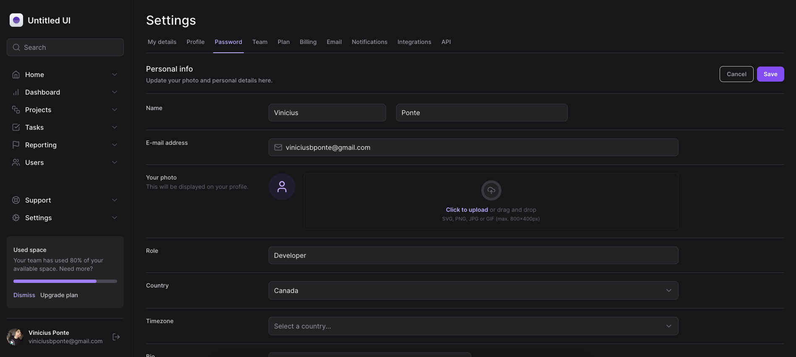

# Tailwind Fundamentals

Este projeto de demonstração tem como objetivo ajudar os desenvolvedores a explorar e compreender os conceitos fundamentais do Tailwind CSS em um ambiente prático e funcional. Ele utiliza o Next.js 13 como estrutura de aplicativo e o Tailwind CSS para estilização.

## Índice

- [Objetivo](#objetivo)
- [Capturas de Tela](#capturas-de-tela)
- [Requisitos de Instalação](#requisitos-de-instalação)

## Objetivo

- Explorar Conceitos Básicos: O projeto oferece exemplos práticos para ajudar a entender os conceitos básicos do Tailwind CSS, como classes de utilitário, cores, tipografia e espaçamento.
- Dark Mode: Demonstra como implementar um modo escuro (dark mode) usando as classes do Tailwind CSS e como alternar facilmente entre os modos claro e escuro.
- Variantes: Explora várias variantes do Tailwind, incluindo hover, focus, active e group, para criar interações dinâmicas e destacar elementos de interface do usuário.
- Slots API: Mostra como usar o Slots API do Tailwind CSS para criar componentes personalizados e reaproveitáveis, permitindo a criação de designs complexos de maneira modular.
- Animações: Introduz animações e transições usando classes do Tailwind para adicionar movimento e dinamismo aos elementos da interface do usuário.

## Capturas de Tela

<div >
    
</div>

<div align="center">
  <div style="display: flex; gap: 16px; align-items: center">
   
    
  </div>
</div>

## Requisitos de Instalação

Para executar o projeto, siga os passos abaixo:

```bash
1. Clone este repositório em sua máquina
$ git clone https://github.com/ViniciusPonte/ignite-tailwind.git

2. Instale as dependencias
$ npm i

3. Rode o projeto através do comando:
$ npm run dev